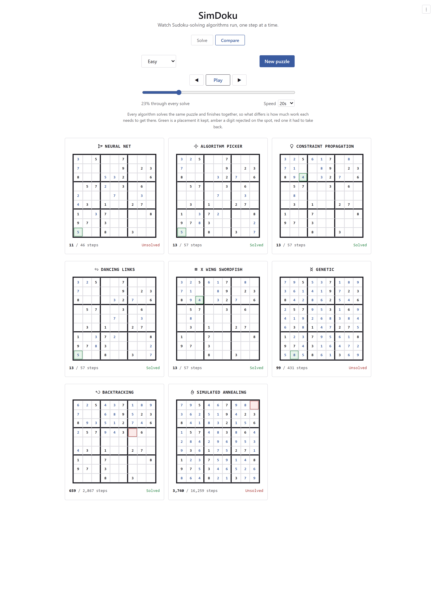
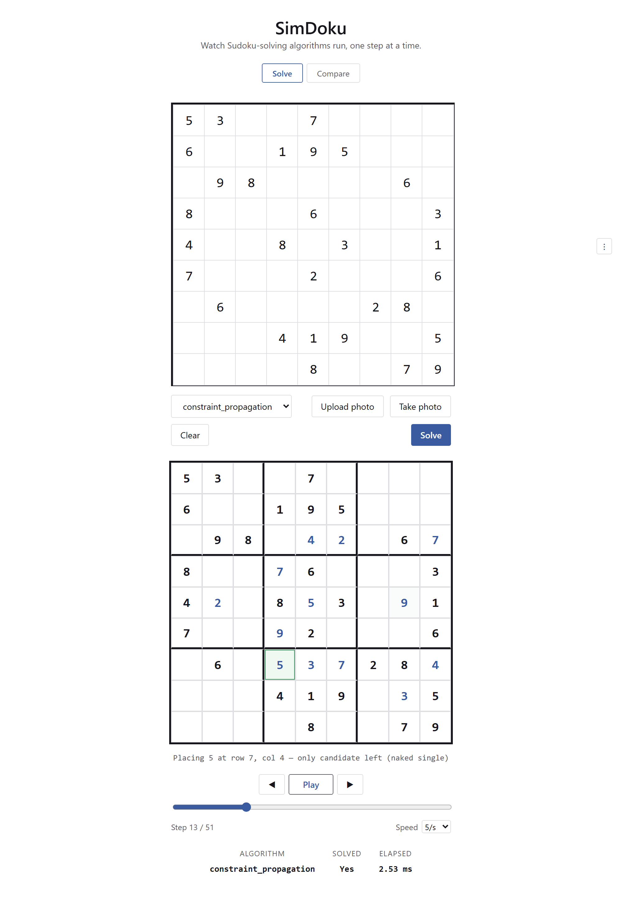
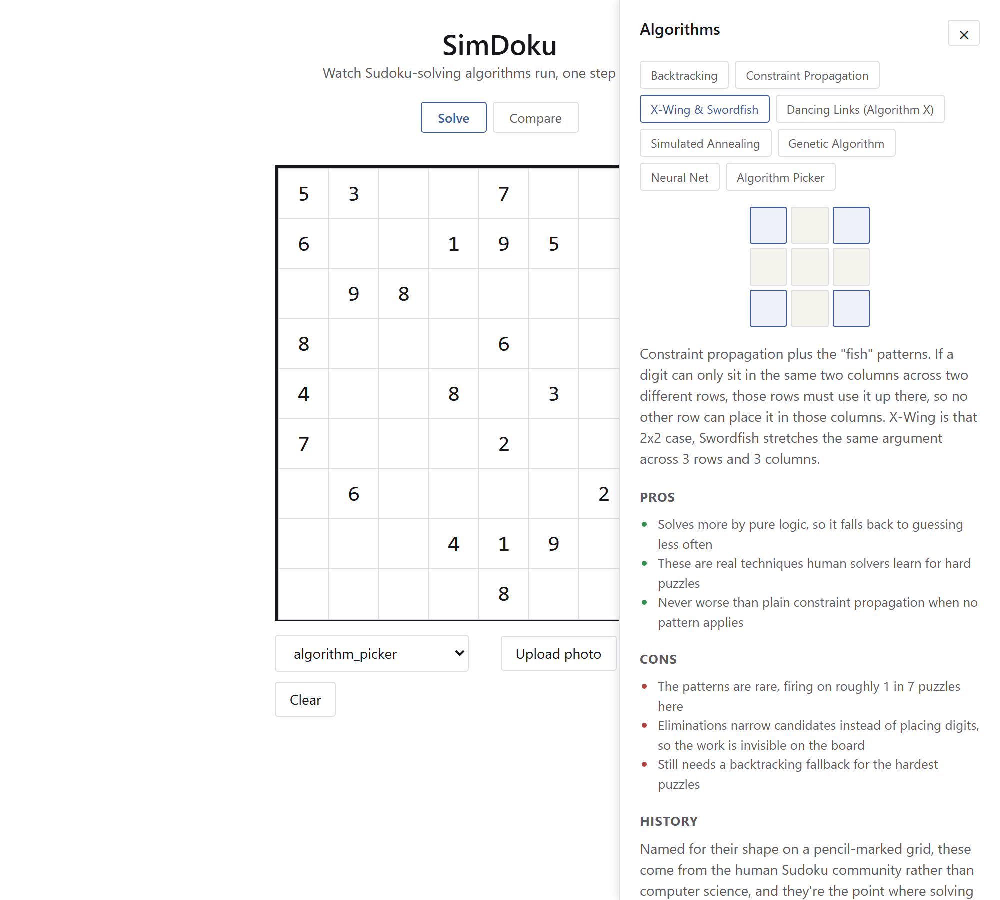

# SimDoku

Watch Sudoku-solving algorithms actually run, one step at a time, and put them
side by side on the same puzzle to see how differently they think.

Eight solvers share one interface: classical search, human deduction
techniques, a neural net, an evolutionary algorithm, and a meta-solver that
predicts which of the others will be fastest. Every one of them returns the
same kind of step trace, so a single visualizer replays all of them.



## What's in it

**Compare** runs every algorithm against the same puzzle and plays their real
step traces side by side. One shared control drives a normalized timeline that
each panel maps onto its own step count, so all the boards start and finish
together and the visible difference is how much work each one needed. On the
easy puzzle above that ranges from 57 steps to 16,259.

**Solve** is the single-algorithm view: enter a puzzle by hand, pick an
algorithm, and step or scrub through its trace with narration explaining each
move.



**Photo input** takes a picture of a printed puzzle, finds the grid with
OpenCV, perspective-corrects it, reads the digits with Tesseract, and drops the
result into the grid for review. Upload a file or use the camera.

**The algorithm panel** (the menu at top right) explains each solver, with
pros, cons, a little history, and a small animation of how it behaves.



## The algorithms

| Algorithm | Approach | Always solves? |
| --- | --- | --- |
| Backtracking | Depth-first search, most-constrained cell first | Yes |
| Constraint propagation | Naked and hidden singles, search only when stuck | Yes |
| X-Wing & Swordfish | Constraint propagation plus "fish" candidate eliminations | Yes |
| Dancing Links | Exact cover via Knuth's Algorithm X | Yes |
| Simulated annealing | Stochastic local search over whole grids | No |
| Genetic | Evolves a population of grids by crossover and mutation | Rarely |
| Neural net | Small CNN placing its most confident digit each round | No |
| Algorithm picker | Predicts the fastest complete solver and delegates | Yes |

The ones that fail are there on purpose. A solver that stalls is far more
informative next to one that doesn't than any amount of prose about
asymptotics, and the genetic algorithm in particular is a compact
demonstration of why evolution struggles on a problem with exactly one correct
answer.

Adding another is one new module plus one registry line. It never requires
touching the API, the frontend, or the visualizer.

## Running it

Prerequisites: Python 3.11+, Node, and
[Tesseract OCR](https://github.com/UB-Mannheim/tesseract/wiki) on your PATH for
the photo input (`winget install --id UB-Mannheim.TesseractOCR -e` on Windows,
`brew install tesseract` or `apt install tesseract-ocr` elsewhere).

```
cd backend && python -m venv .venv && .venv\Scripts\activate
pip install torch --index-url https://download.pytorch.org/whl/cpu
pip install -r requirements.txt
cd ../frontend && npm install
cd .. && npm install
```

Installing torch from the CPU wheel index first is worth it: the default
package on Linux pulls the CUDA build and several GB of NVIDIA dependencies,
none of which a 9x9 board needs.

Then, from the repo root:

```
npm run dev
```

That starts the backend on `:8000` and the frontend on `:5173`, with API
requests proxied so the two behave as one origin.

## Deploying

The `Dockerfile` builds the frontend, installs Tesseract and the CPU build of
torch, and serves the bundle from the backend. One image, one port, no CORS to
configure:

```
docker build -t simdoku .
docker run -p 8000:8000 simdoku
```

It honors `$PORT` if the host sets one, so it should run as-is on Render,
Railway, Fly.io, or Cloud Run. Expect a large image, since torch and OpenCV
dominate it. If you ever host the frontend separately, point it at the API with
`VITE_API_BASE_URL` at build time and list its origin in `SIMDOKU_CORS_ORIGINS`
on the backend.

## Regenerating the committed artifacts

The trained models and the puzzle dataset are committed, so none of this is
needed just to run the app. From `backend/` with the venv active:

```
python -m scripts.train_neural_solver      # retrain the CNN on self-generated puzzles
python -m scripts.train_algorithm_picker   # retime every puzzle and refit the picker
python -m scripts.import_puzzle_bank       # re-download the graded puzzle bank
```

The puzzle bank comes from
[sudoku-exchange-puzzle-bank](https://github.com/grantm/sudoku-exchange-puzzle-bank),
which is public domain.
